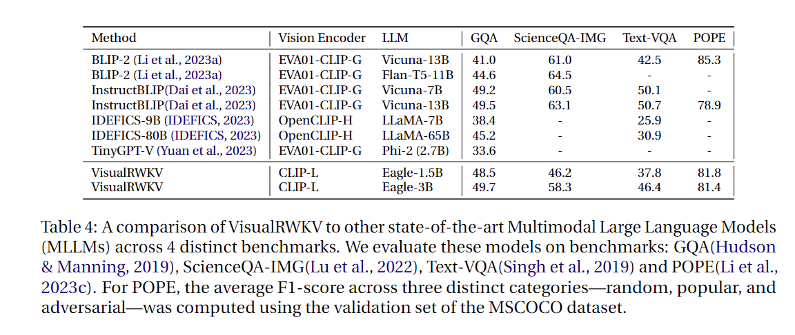
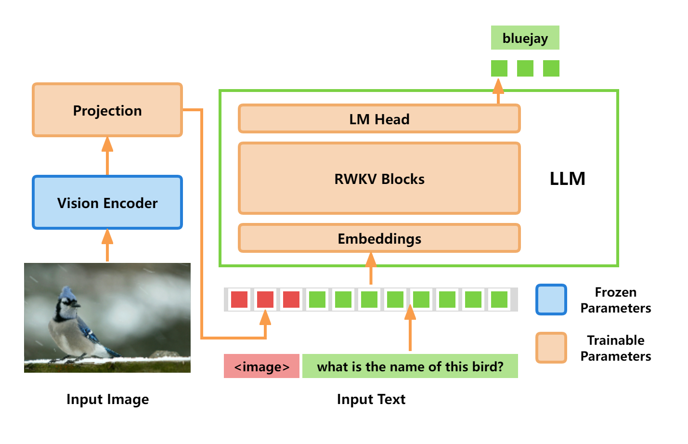

# VisualRWKV: A Visual-Enhanced RWKV

  

📖 [Technical report]() | 🤗 [Model](https://huggingface.co/howard-hou/visualrwkv-5) | 🐰 [Demo](https://huggingface.co/spaces/howard-hou/VisualRWKV-Gradio-1)

VisualRWKV is the visual-enhanced version of the RWKV language model, enabling RWKV to handle various visual tasks.By utilizing a loosely coupled adapter design, visual capabilities can be effortlessly enhanced while preserving the performance of the RWKV language model. This approach allows for easy integration and interchangeability without compromising the core functionality of RWKV.

## Architecture

  

## News and Updates
* 2024.05.11 🔥 **VisualRWKV-6.0 is released!**. 
* 2024.03.25 🔥 **VisualRWKV-5.0 is released!**. 

## Pre-training and Fine-tuning
**Lastest stable verion is VisualRWKV-v6/v6.0, please cd to the dir VisualRWKV-v6/v6.0[VisualRWKV-v6](https://github.com/howard-hou/VisualRWKV/tree/main/VisualRWKV-v6/v6.0) for running the code.**

VisualRWKV training consists of two stages: 
- (1) Pre-training stage: use pretrain dataset to train a projection layer from *frozen pretrained* vision encoder to the *frozen RWKV*; 
- (2) Fine-tuning stage: use visual instruction data, to teach the model to follow visual instructions.

### Download RWKV checkpoints for Pre-training
If you want to pretrain by yourself. You can download the RWKV checkpoints from the following links in the table.
| VisualRWKV Version | RWKV 1B6 | RWKV 3B | RWKV 7B |
| --- | --- | --- | --- |
| VisualRWKV-v6 | [RWKV-x060-World-1B6](https://huggingface.co/BlinkDL/rwkv-6-world/blob/main/RWKV-x060-World-1B6-v2.1-20240328-ctx4096.pth) |[RWKV-x060-World-3B](https://huggingface.co/BlinkDL/rwkv-6-world/blob/main/RWKV-x060-World-3B-v2.1-20240417-ctx4096.pth) | [RWKV-x060-World-7B](https://huggingface.co/BlinkDL/rwkv-6-world/blob/main/RWKV-x060-World-7B-v2.1-20240507-ctx4096.pth) |