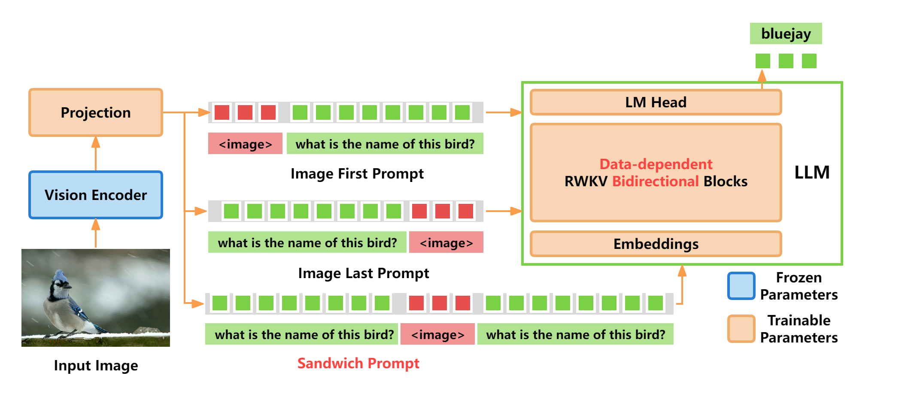

# **VisualRWKV: A Visual Language Model Based on RWKV**
<p align="center">
  
</p>

**📖 [Paper](https://arxiv.org/abs/2406.13362) | 🤗 [Model](https://huggingface.co/howard-hou/visualrwkv-6) | 🐰 [Demo](https://huggingface.co/spaces/howard-hou/VisualRWKV-Gradio-1)**

VisualRWKV is a **visual language model** based on the RWKV language model, enabling RWKV to handle various visual tasks.

### Key Papers:
- **[VisualRWKV: Exploring Recurrent Neural Networks for Visual Language Models](https://arxiv.org/abs/2406.13362)**
- **[Eagle and Finch: RWKV with Matrix-Valued States and Dynamic Recurrence](https://arxiv.org/abs/2404.05892)**

## 🚀 News and Updates
- **2025.02.10** 🔥 **VisualRWKV-7.00 checkpoints released!** [[weights]](./MODEL_ZOO.md)
- **2024.01.11** 🔥 **VisualRWKV-7.00 code released!** [[code]](https://github.com/howard-hou/VisualRWKV/tree/main/VisualRWKV-v7/v7.00)
- **2024.06.25** 🔥 **VisualRWKV-6.0 checkpoints released!** [[weights]](./MODEL_ZOO.md)
- **2024.05.11** 🔥 **VisualRWKV-6.0 code released!** [[code]](https://github.com/howard-hou/VisualRWKV/tree/main/VisualRWKV-v6/v6.0)
- **2024.03.25** 🔥 **VisualRWKV-5.0 released!**

---

## 📊 VisualRWKV v7.0 Metrics
The following table presents the performance comparison between VisualRWKV v7.0 and its predecessor VisualRWKV v6 across several benchmark datasets.

| Model Name         | VQAv2(test-dev) | ScienceQA(IMG) | TextVQA | GQA(acc) | Vision Encoder                              |
|--------------------|--------------------|----------------|---------|----------|----------------------------------------------|
| v0700+0b1          | 75.22              | 50.62          | 37.90   | 59.92    | SigLIP+dinov2+Sam |
| v0700+0b4          | 77.85              | 54.98          | 41.05   | 62.30    | SigLIP+dinov2+Sam |
| v0700+1b5          | 79.84              | 59.74          | 49.49   | 63.20    | SigLIP+dinov2+Sam |
| VisualRWKV - v6 1.6B | 73.66 | 57.02 | 48.70 | 58.23 | SigLIP+dinov2+Sam | 
| VisualRWKV - v6 3B | 71.52 | 65.34 | 48.68 | 59.56 | CLIP | 
| VisualRWKV - v6 7B | 75.82 | 68.22 | 51.01 | 64.27 | CLIP |

---

## 🏗️ Architecture
<p align="center">
  
</p>

## 🦄 Model Zoo
VisualRWKV weights, checkpoints, and related results can be found in the [Model Zoo](./MODEL_ZOO.md).

---

## 💻 Installation

### 1. Clone the repository
Clone the repo and navigate to the VisualRWKV folder. Version 7.00 is the stable release.
```bash
git clone https://github.com/howard-hou/VisualRWKV.git
cd VisualRWKV-v7/v7.00
```

### 2. Install dependencies
Create a conda environment and install the necessary packages.
```bash
conda create -n visualrwkv python=3.10 -y
conda activate visualrwkv
pip install --upgrade pip  # Enable PEP 660 support

# Install dependencies:
pip install torch==1.13.1+cu117 --extra-index-url https://download.pytorch.org/whl/cu117
pip install pytorch-lightning==1.9.5 deepspeed==0.7.0 wandb ninja

# For best performance, use the following:
pip install torch --upgrade --extra-index-url https://download.pytorch.org/whl/cu126
pip install pytorch-lightning==1.9.5 deepspeed wandb ninja --upgrade
```

---

## 📚 Pre-training and Fine-tuning

**Latest stable version is VisualRWKV-v7/v7.00. Please navigate to the VisualRWKV-v7/v7.00 directory for running the code.**

VisualRWKV training consists of two stages:

1. **Pre-training**: Using a pretrain dataset to train a projection layer from a *frozen pretrained vision encoder* to the *frozen RWKV*.
2. **Fine-tuning**: Using visual instruction data to teach the model to follow visual instructions.

---

### 🔥 Pre-training

#### Download LLaVA-Pretrain Dataset
You can download the [LLaVA-Pretrain](https://huggingface.co/datasets/liuhaotian/LLaVA-Pretrain).

#### Download RWKV Checkpoints for Pre-training
If you want to pretrain the model yourself, download the following RWKV checkpoints.

| **VisualRWKV Version** | **RWKV 0B1** | **RWKV 0B4** | **RWKV 1B5** | **RWKV 3B** | **RWKV 7B** |
| --- | --- | --- | --- |--- | --- |
| **VisualRWKV-v6** | - | - | [RWKV-x060-World-1B6](https://huggingface.co/BlinkDL/rwkv-6-world/blob/main/RWKV-x060-World-1B6-v2.1-20240328-ctx4096.pth) | [RWKV-x060-World-3B](https://huggingface.co/BlinkDL/rwkv-6-world/blob/main/RWKV-x060-World-3B-v2.1-20240417-ctx4096.pth) | [RWKV-x060-World-7B](https://huggingface.co/BlinkDL/rwkv-6-world/blob/main/RWKV-x060-World-7B-v2.1-20240507-ctx4096.pth) |
| **VisualRWKV-v700** | [RWKV-x070-World-0B1](https://huggingface.co/BlinkDL/rwkv-7-world/blob/main/RWKV-x070-World-0.1B-v2.8-20241210-ctx4096.pth)  | [RWKV-x070-World-0B4](https://huggingface.co/BlinkDL/rwkv-7-world/blob/main/RWKV-x070-World-0.4B-v2.9-20250107-ctx4096.pth)  | [RWKV-x070-World-1B5](https://huggingface.co/BlinkDL/rwkv-7-world/blob/main/RWKV-x070-World-1.5B-v3-20250127-ctx4096.pth) | - | - |

#### Pre-training Command
To pretrain the VisualRWKV-v7.0 model (example for using 4 GPUs with a 1B5 RWKV model):
please refer to [pretrain script](VisualRWKV-v7/v7.00/scripts/train/rwkv0b1_pretrain.sh)

---

### 🔧 Visual Instruction Tuning

#### Prepare Data
Refer to the [LLaVA](https://github.com/haotian-liu/LLaVA/blob/main/README.md) project for visual instruction data.

#### Fine-tuning Command
To fine-tune the VisualRWKV-v7.0 model, please refer to [fine-tune script](VisualRWKV-v7/v7.00/scripts/train/rwkv0b1_mix665k.sh)
